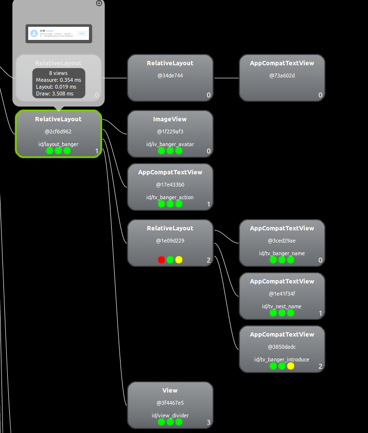

<h1 style="text-align:center">Android UI卡顿优化</h1>

### 卡顿产生的原因：

* 在UI线程中做耗时操作，导致UI线程卡顿；

* 布局Layout过于复杂，无法在16ms内完成渲染；

* Overdraw（过度绘制）：屏幕上的某个像素在同一帧的时间内被绘制了多次。Overdraw有时候是因为UI布局存在大量重叠的部分，还有的时候是因为非必须的重叠背景。打开开发者选项中的过度绘制选项，可观察绘制情况。


　　蓝、绿、淡红，深红代表了4种不同程度的Overdraw的情况，我们的目标就是尽量减少红色Overdraw，看到更多的蓝色区域。

* View频繁的触发measure、layout，导致measure、layout累计耗时过多及整个View频繁的重新渲染；

* 冗余资源及逻辑等导致加载和执行缓慢；

* 同一时间动画执行的次数过多，导致CPU或GPU负载过重；


## 布局方面的优化
### 一、减少布局的嵌套层级
##### 1 多层的Linearlayout 改为 RelativeLayout，尤其是Adapter里的item布局，层级越少越好。
* 对于嵌套层次多的情况，推荐使用RelativeLayout，因为LinearLayout在onMeasure方法中对子View是遍历测量的。

* 对于嵌套布局层次很少的情况，比如就一层时，使用 LinearLayout，因为 LinearLayout 布局性能更高一点，而RelativeLayout 布局需要至少Measure两次（横向纵向分别进行一次排序测量）。

* LinearLayout在有weight时，也会调用子View2次onMeasure；所以慎用weight,可以在设置了`android:layout_weight="1"`的地方使用`android:layout_width="0dp"`。

* RelativeLayout的子View如果高度和RelativeLayout不同时，尽量使用padding代替margin效率高。

* 可以用FrameLayout的地方优先考虑FrameLayout。

优化前：


优化后：




##### 2 ScrollView内嵌头部+列表的布局，可改为一个RecycleView（可参考WrapRecycleAdapter）

优化前：


优化后：


##### 3 使用merge,viewstub等，不过merge在使用时有一些限制。对`<include>`里的布局使用`<merge>`可以减少一层。

##### 4 清理一些无用的父视图、子视图。


### 二、Background会影响绘制
##### 1 移除Window默认的Background
* 代码中设置,Activity中：
```
getWidow.setBackgroundDrawable(null);
```

* 或者在style文件中设置：
```
<style name="theme_main" parent="Theme.AppCompat.Light.NoActionBar">
  <item name="android:windowBackground">@null</item>
</style>
```
##### 2 移除布局文件中非必需的Background，尽量在根布局中设置一次即可。

优化前：


优化后：


- - - - - - - - - - - - - - - - -
## 代码方面的优化
### 一、数据库写、网络请求等耗时操作放在线程中。
* 观察ProgressBar或者动画，若有耗时操作，能看到动画丢帧。

### 二、优化ViewPager
##### 1 如果pager页只有很少几个时：
* 设置setOffscreenPageLimit的数量，以防止频繁的创建与销毁;
* 不销毁fragment;

```
覆盖PagerAdapter的destroyItem并注释掉父类方法：

@Override
public void destroyItem(ViewGroup container, int position, Object object) {
    //super.destroyItem(container, position, object);
}
```

##### 2 当pager页过多时，防止预加载，因为setOffscreenPageLimit即使设置为0,也会预加载相邻的页面，增加性能的损耗，故需避免加载fragment1的时候加载fragment2。

* 可以通过Fragment的setUserVisibleHint方法判断Fragment是否可见，当可见时才加载数据并展示。

```

@Override  
    public void setUserVisibleHint(boolean isVisibleToUser) {  
        super.setUserVisibleHint(isVisibleToUser);  
        if(isVisibleToUser) {  
            可见
        } else {  
            不可见
        }  
    }
```
* 还可以在加载时判断数据是否已不为空，如果不为空，可以不再请求，节省流量。

##### 3 复用Fragment的RootView，以防每次onCreateView时又重新创建布局

```
在onCreateView方法内复用RootView:

@Override
public View onCreateView(LayoutInflater inflater, ViewGroup container, Bundle
        savedInstanceState) {
    super.onCreateView(inflater, container, savedInstanceState);
    if (mRootView == null) { // 防止重新创建布局
        mRootView = inflater.inflate(R.layout.fragment_dis_sale, null);
        initView();
    }
    return mRootView;
}
```

##### 4 ViewPager里包含ListView时，layout_height属性为wrap_content会导致adapter getView不断被调用，建议改成match_content
```
<ListView
    android:layout_width="match_parent"
    android:layout_height="match_parent" />
```

参考文章：

[ViewPager中切换界面Fragment被销毁的问题分析](http://www.cnblogs.com/monodin/p/3866441.html)

[ViewPager防止Fragment销毁以及取消Fragment的预加载](http://blog.csdn.net/mr_liabill/article/details/48749807)

[setUserVisibleHint-- fragment真正的onResume和onPause方法](https://www.cnblogs.com/ganchuanpu/p/6690935.html)

### 三、ScrollView嵌套RecycleView时，手势冲突导致滑动不流畅
解决手势冲突：
```
if (Build.VERSION.SDK_INT >= Build.VERSION_CODES.LOLLIPOP) {
    mRv.setNestedScrollingEnabled(false); // 解决滑动冲突
}
```

- - - - - - - - - - - - - - - - -

<h4 style="text-align:right">by 王静 2017.12.12</h4>
