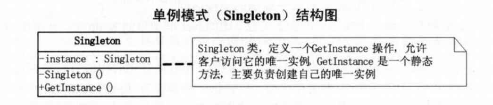

<h2 style="text-align:center">常用设计模式</h2>

设计模式是一套被反复使用的、多数人知晓的、经过分类编目的、代码设计经验的总结，是众多软件开发人员经过相当长的一段时间的试验和错误总结出来的。使用设计模式是为了重用代码、让代码更容易被他人理解、保证代码可靠性。

### 设计模式分类
* 创建型模式
* 结构型模式
* 行为型模式


### 设计模式原则


### 常用设计模式
#### 1、单例模式
定义：
```
单例模式（Singleton）：保证一个类仅有一个实例，并提供一个访问它的全局访问点。
```


优点：
* 对于那些比较耗内存的类，只实例化一次可以大大提高性能，尤其是在移动开发中。
* 保持程序运行的时候该中始终只有一个实例存在内存中

实现方式：


应用场景：


#### 2、观察者模式
#### 3、适配器模式
#### 4、建造者模式
#### 5、命令模式
#### 6、原型模式
#### 7、策略模式


--------------------------
<h4 style="text-align:right">by 王静</h4>
