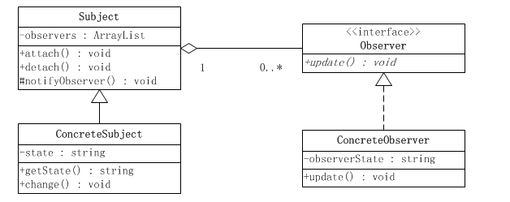
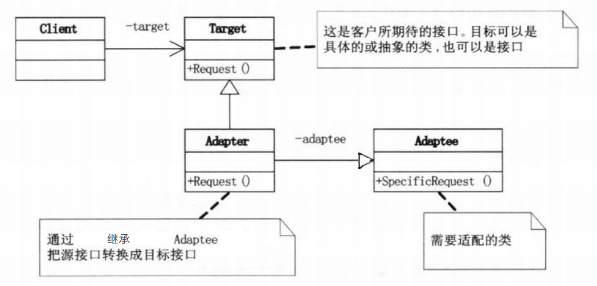
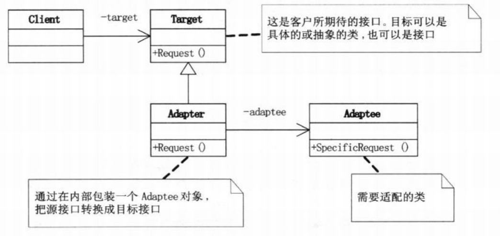
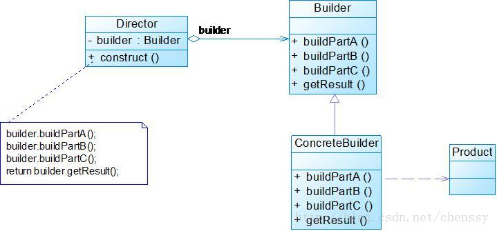

<h2 style="text-align:center">常用设计模式</h2>

### 什么是设计模式
* 是一套被反复使用的、多数人知晓的、经过分类编目的、代码设计经验的总结，是众多软件开发人员经过相当长的一段时间的试验和错误总结出来的。
* 是某类特定问题的代码设计解决方案。

### 设计模式作用
* 提高代码复用率，降低开发成本和周期
* 提高代码可维护性、可拓展性
* 使代码更加优雅、让代码更容易被他人理解;

### 设计模式原则
在设计模式进行设计时需要遵循以下的面向对象的原则：

* 单一职责原则
```
一个类应该仅有一个引起它变化的原因。
```
> 如果一个类承担的职责过多，就等于把这些职责耦合在了一起。一个职责的变化可能会削弱或者抑制这个类完成其它职责的能力。


* 开放封闭原则
```
一个实体（类、函数、模块等）应该是可以扩展的，但是不可以修改的。
```
> 1.即每次发生变化时，要通过添加新的代码来增强现有类的行为，而不是修改原有的代码，即--对于扩展是开放的，对于更改是封闭的。
>
2.符合开放封闭原则的最好方式是提供一个固有的接口，然后让所有可能发生变化的类实现该接口，让固定的接口与相关对象进行交互。即--关键是抽象。


* 里氏替换原则
```
子类(sub type)必须能够替换掉它们的父类型(base type)。
```
> 1.也就是尽量不要从可实例化的父类中继承，而是要使用基于抽象类和接口的继承。
>
> 2.只有当子类替换掉父类后软件的功能不受影响时，父类才能真正地被复用，而子类也可以在父类的基础上添加新的行为。

* 依赖倒置原则
```
a.高层模块不应该依赖于低层模块。二者都应该依赖于抽象。
b.抽象不应该依赖于细节，细节应该依赖于抽象。
```
> 所谓的 “面向接口编程，而不是面向实现编程”。这样可以降低客户与具体实现的耦合。

* 接口隔离原则
```
使用多个专门功能的接口，而不是使用单一的总接口。
```
> 不要让一个单一的接口承担过多的职责，而应把每个职责分离到多个专门的接口中，进行接口分离。

* 迪米特法则
```
一个软件实体应当尽可能少地与其它实体发生交互作用。
```
> 和自己的直接朋友说话，不要和陌生人说话。
>
> 类与类之间的关系越密切，耦合度就越大，当修改其中一个类时，就会影响到另一个类的使用。

* 合成复用原则
```
在一个新的对象里面使用一些已有的对象，使之成为新对象的一部分。
```
> 新对象通过向这些对象的委派达到复用已有功能的目的。简单地说，就是要尽量使用合成/聚合，尽量不要使用继承。


### 设计模式分类


主要分类三大类：

* 创建型模式
> 创建型模式(Creational Pattern)对类的实例化过程进行了抽象，能够将软件模块中对象的创建和使用分离。

```
单例模式(Singleton)
工厂方法模式(Factory Method)
抽象工厂模式(Abstract Factory)
建造者模式(Builder)
原型模式(Prototype)
```

* 结构型模式
> 结构型模式(Structural Pattern)描述如何将类或者对象结合在一起形成更大的结构，就像搭积木，可以通过简单积木的组合形成复杂的、功能更为强大的结构。
>
> 结构型模式可以分为类结构型模式和对象结构型模式。

```
适配器模式(Adapter)
桥接模式(Adapter)
装饰模式(Decorator)
门面模式/外观模式(Facade)
组合模式(Composite)
享元模式(Flyweight)
代理模式(Proxy)
```

* 行为型模式
> 行为型模式(Behavioral Pattern)是对在不同的对象之间划分责任和算法的抽象化。
>
> 通过行为型模式，可以更加清晰地划分类与对象的职责，并研究系统在运行时实例对象之间的交互。
>
> 行为型模式分为类行为型模式和对象行为型模式两种。

```
模版方法模式(Template Method)
命令模式(Command)
迭代器模式(Iterator)
观察者模式(Observer)
中介者模式(Mediator)
状态模式(State)
策略模式(Strategy)
责任链模式(Chain of Responsibility)
访问者模式(Visitor)
备忘录模式(Memento)
解释器模式(Interpreter)
```


### 常用设计模式
#### 1、观察者模式
##### 定义：
```
观察者模式（Observer）：定义对象间的一种一对多的依赖关系,当一个对象的状态发生改变时, 所有依赖于它的对象都得到通知并被自动更新。
```

##### 实现：
观察者模式结构图：




观察者模式通常涉及的角色：

* Subject(抽象被观察者):定义了一个观察者集合，注册和注销观察者对象和通知方法。
* ConcreteSubject(具体被观察者):被观察者的具体实例，该实例包含可以经常发生变化的数据，数据变化时发出通知。
* Observer(抽象观察者):观察者的接口类，声明了更新数据的方法。
* ConcreteObserver(具体观察者)：实现接口中的方法，需要在被观察者中注册，也可以被其注销。


---代码演示---


##### 优缺点：
优点：

1. 实现了表示层和数据逻辑层的分离，定义了消息更新传递机制，并抽象了更新接口，使得可以有各种各样不同的表示层充当具体观察者；
2. 实现了观察目标和观察者之间的抽象耦合；
3. 符合开闭原则，增加新的具体观察者无须修改原有系统代码。

缺点：

1. 如果一个观察目标有很多的直接或间接的观察者，将所有的观察者都通知到会花费很多时间；
2. 观察者只知道观察目标发生了变化，但是不知道是怎么发生的变化。
3. 如果在被观察者之间有循环依赖的话，被观察者会触发它们之间进行循环调用，导致系统崩溃。在使用观察者模式是要特别注意这一点。

##### 应用场景：
* 当一个对象的数据更新时需要通知其他对象，但这个对象又不希望和被通知的那些对象形成紧耦合。
* 当一个对象的数据更新时，这个对象需要让其他对象也各自更新自己的数据，但这个对象不知道具体有多少对象需要更新数据。


在Android中的应用：

1. Java提供了Observer的支持，有Observable类和Observer接口
2. ContentResolver
3. 广播BroadcastReceiver
4. Android中的各种Listener
5. ListView、RecyclerView的数据改变更新界面

    例：

    抽象被观察者Subject:
```
public abstract class Observable<T> {
    protected final ArrayList<T> mObservers = new ArrayList<T>();

    public void registerObserver(T observer) {
        if (observer == null) {
            throw new IllegalArgumentException("The observer is null.");
        }
        synchronized(mObservers) {
            if (mObservers.contains(observer)) {
                throw new IllegalStateException("Observer " + observer + " is already registered.");
            }
            mObservers.add(observer);
        }
    }

    public void unregisterObserver(T observer) {
        if (observer == null) {
            throw new IllegalArgumentException("The observer is null.");
        }
        synchronized(mObservers) {
            int index = mObservers.indexOf(observer);
            if (index == -1) {
                throw new IllegalStateException("Observer " + observer + " was not registered.");
            }
            mObservers.remove(index);
        }
    }

    public void unregisterAll() {
        synchronized(mObservers) {
            mObservers.clear();
        }
    }
}
```

  具体被观察者ConcreteSubject:

```
public class DataSetObservable extends Observable<DataSetObserver> {

    public void notifyChanged() {
        synchronized(mObservers) {
            for (int i = mObservers.size() - 1; i >= 0; i--) {
                mObservers.get(i).onChanged();
            }
        }
    }
}

```

  抽象观察者Observer:
```
public abstract class DataSetObserver {

    public void onChanged() {
        // Do nothing
    }
}
```

  具体观察者ConcreteObserver:
```
class AdapterDataSetObserver extends DataSetObserver {

        private Parcelable mInstanceState = null;

        @Override
        public void onChanged() {
            mDataChanged = true;
            mOldItemCount = mItemCount;
            mItemCount = getAdapter().getCount();

            // Detect the case where a cursor that was previously invalidated has
            // been repopulated with new data.
            if (AdapterView.this.getAdapter().hasStableIds() && mInstanceState != null
                    && mOldItemCount == 0 && mItemCount > 0) {
                AdapterView.this.onRestoreInstanceState(mInstanceState);
                mInstanceState = null;
            } else {
                rememberSyncState();
            }
            checkFocus();
            requestLayout();
        }
    }
```

client调用:
```
ListView.java

@Override
public void setAdapter(ListAdapter adapter) {
        ...
        mDataSetObserver = new AdapterDataSetObserver();
        mAdapter.registerDataSetObserver(mDataSetObserver);
        ...
}

BaseAdapter.java

public abstract class BaseAdapter implements ListAdapter, SpinnerAdapter {
    private final DataSetObservable mDataSetObservable = new DataSetObservable();

    public void registerDataSetObserver(DataSetObserver observer) {
        mDataSetObservable.registerObserver(observer);
    }

    public void unregisterDataSetObserver(DataSetObserver observer) {
        mDataSetObservable.unregisterObserver(observer);
    }

    public void notifyDataSetChanged() {
        mDataSetObservable.notifyChanged();
    }
}
```

--------------
#### 2、适配器模式
##### 定义：
```
将一个类的接口转换成客户端希望的另外一个接口，从而使原本由于接口不兼容而不能一起工作的那些类可以一起工作。
```

##### 实现：
适配器模式涉及的角色有：

* 目标接口target，也可以是抽象的类
* 源Adaptee:需要适配的接口
* 适配器Adapter:将源接口转换为目标接口。

适配器模式有两种：类适配器模式和对象适配器模式。

A. 类适配器模式:

Adapter与Adaptee是继承关系。



B. 对象适配器模式(常用)：

（根据“合成复用原则”，在系统中尽量使用关联关系来替代继承关系，因此大部分结构型模式都是对象结构型模式。）

Adapter与Adaptee是委派关系。




---代码演示---

##### 优缺点：
优点

1. 更好的复用性：系统需要使用现有的类，而此类的接口不符合系统的需要。那么通过适配器模式就可以让这些功能得到更好的复用。
2. 透明、简单：客户端可以调用同一接口，因而对客户端来说是透明的。
3. 更好的扩展性：在实现适配器功能的时候，可以调用自己开发的功能，从而自然地扩展系统的功能。
4. 符合开放-封闭原则：同一个适配器可以把适配者类和它的子类都适配到目标接口；可以为不同的目标接口实现不同的适配器，而不需要修改待适配类。

缺点

1. 过多的使用适配器，会让系统非常零乱，追溯困难。因此如果不是很有必要，可以不使用适配器，而是直接对系统进行重构。


##### 应用场景：
* 系统需要使用现有的类，而这些类的接口不符合系统的需要。
* 想要建立一个可以重复使用的类，用于与一些彼此之间没有太大关联的一些类，包括一些可能在将来引进的类一起工作。
* 需要一个统一的输出接口，而输入端的类型不可预知。我们可以通过Adapter返回一个统一的输出，而具体的输入留给用户处理。


应用：

1. InputStreamReader和OutputStreamWriter就是InputStream和OutputStream针对Reader和Writer接口的适配。
2. Android ListView的Adapter。

    例：

    ListView需要能够显示各式各样的视图，每个人需要的显示效果各不相同，显示的数据类型、数量等也千变万化。Android的做法是增加一个Adapter层来应对变化，将ListView需要的接口抽象到Adapter对象中，这样只要用户实现了Adapter的接口，ListView就可以按照用户设定的显示效果、数量、数据来显示特定的Item View。

    * Target角色和Adapter角色融合在一起,Adapter中的方法就是目标方法(如:getView()方法);
    * Adaptee角色就是ListView的需要被处理的千变万化的数据集与ItemView。
    * 最终通过getView()方法统一将ItemView输出为View。

```
class xxx extends BaseAdapter {

    @Override
    public int getCount() {
        return 0;
    }

    @Override
    public NestInfo getItem(int position) {
        return null;
    }

    @Override
    public long getItemId(int position) {
        return 0;
    }

    @Override
    public View getView(int position, View convertView, ViewGroup parent) {
        ViewHolder holder;
        if (convertView == null) {
            holder = new ViewHolder();
            convertView = LayoutInflater.from(mContext).inflate(R.layout.layout_item, null);
            convertView.setTag(holder);
        } else {
            holder = (ViewHolder) convertView.getTag();
        }
        return convertView;
    }
}

```


------------
#### 3、建造者模式
##### 定义：
```
将一个复杂对象的构建与它的表示分离，使得同样的构建过程可以创建不同的表示。
```
##### 实现：



建造者模式通常包括下面几个角色：

* Product：要创建的复杂对象。
* Builder：抽象Builder类或接口，规范产品的组建。这个接口规定要实现复杂对象的哪些部分的创建，并不涉及具体的对象部件的创建。
* ConcreteBuilder：实现Builder接口，针对不同的商业逻辑，具体化复杂对象的各部分的创建。 在建造过程完成后，提供产品的实例。
* Director：统一组装过程。

在实际开发中，Director角色经常会被省略。而直接使用一个Builder来进行对象的组装，这个Builder通常为链式调用。这种形式使整个结构更加简单，也能对Product对象的组装过程有更精细的控制。


---代码演示---

##### 优缺点：
优点：

1. 良好的封装性，客户端不必知道产品内部组成的细节。
2. 具体的建造者类之间是相互独立的，对系统的扩展非常有利。
3. 由于具体的建造者是独立的，因此可以对建造过程逐步细化，而不对其他的模块产生任何影响。

缺点：

1. 建造者模式所创建的产品一般具有较多的共同点，其组成部分相似，如果产品之间的差异性很大，则不适合使用建造者模式，因此其使用范围受到一定的限制。
2. 如果产品的内部变化复杂，可能会导致需要定义很多具体建造者类来实现这种变化，导致系统变得很庞大。

##### 应用场景：
* 需要生成的产品对象有复杂的内部结构，这些产品对象具备共性；
* 隔离复杂对象的创建和使用，并使得相同的创建过程可以创建不同的产品。
* 相同的方法，不同的执行顺序，产生不同的产品。

应用：

1. StringBuilder、StringBuffer。
2. Android AlertDialog.Builder。Builder同时扮演了builder、ConcreteBuilder、Director的角色，简化了Builder模式的设计。


--------------------------
参考：

* 《Android源码设计模式解析与实战》
* 《大话设计模式》
* [https://www.jianshu.com/p/6e5eda3a51af](https://www.jianshu.com/p/6e5eda3a51af)

<h4 style="text-align:right">by 王静</h4>
