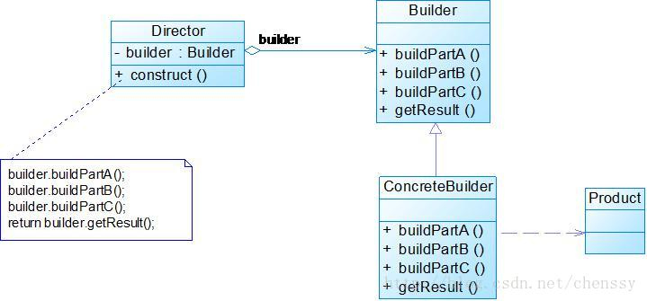

<h2 style="text-align:center">常用设计模式2</h2>
### 常用设计模式

#### 4、代理模式(Proxy)
##### 定义：
```
给某一个对象提供一个代理，并由代理对象控制对原对象的引用。
```

##### 解决的问题：

例如：

* 快捷方式
* 代购

##### 实现：
代理模式涉及的角色有：

* Subject（抽象主题角色）：真实主题和代理主题的共同接口，使得在任何使用真实主题的地方都可以使用代理主题。
* RealSubject（真实主题角色）：定义了代理角色所代表的真实对象，是业务逻辑的具体执行者。
* Proxy（代理主题角色）：代理主题角色内部包含了对真实主题的引用，从而可以在任何时候操作真实主题对象；


---代码演示---


##### 应用场景：
* 远程代理：客户端需要访问远程主机中的对象时
* 虚拟代理：需要一个消耗资源较少的对象来代表一个消耗资源较多的对象
* 安全代理： 用来控制真实对象访问时的权限
* 智能指引：当调用真实对象时，代理处理另外一些事

应用：

1.


##### 优缺点：
优点

1. 协调了调用者和被调用者，一定程度上降低了系统的耦合度
2. 代理对象作为客户端和目标对象之间的中介，起到了保护目标对象的作用

缺点

1. 在不必要的情况下使用代理会导致性能下降
2. 由于在客户端和真实主题之间增加了代理对象，因此会造成请求的处理速度变慢；
3. 实现代理模式需要额外的工作（有些代理模式的实现非常复杂），从而增加了系统实现的复杂度。


------------
#### 5、门面模式/外观模式(Facade)
##### 定义：
```
为子系统中的一组接口提供一个一致的入口，外观模式定义了一个高层接口，这个接口使得这一子系统更加容易使用。
```

##### 解决的问题：

* 避免了系统与系统之间的高耦合度
* 使得复杂的子系统用法变得简单


##### 实现：


外观模式通常包括下面几个角色：

* SubSystem（子系统角色）：在软件系统中可以有一个或者多个子系统角色，每一个子系统可以不是一个单独的类，而是一个类的集合。
* Facade（外观角色）：在客户端可以调用这个角色的方法，在外观角色中可以知道相关的子系统的功能和责任。


---代码演示---

##### 优缺点：
优点：

1. 对客户端屏蔽了子系统组件，减少了客户端需要处理的对象数量，并且使得子系统使用起来更加容易。
2. 降低了客户类与子系统类的耦合度，实现了子系统与客户之间的松耦合关系。
3. 提高了客户端使用的便捷性，使得客户端无须关心子系统的工作细节，通过外观角色即可调用相关功能。

缺点：

1. 不能很好地限制客户使用子系统类，如果对客户访问子系统类做太多的限制则减少了可变性和灵活性。

##### 应用场景：
* 想要为访问一系列复杂的子系统提供一个统一的简单入口。
* 客户端与多个子系统之间存在很大的依赖性，引入外观类可以将子系统和客户端解耦。
* 在层次化结构中，可以使用外观模式定义系统中每一层的入口，层与层之间不直接产生联系。

应用：

1. 。

------------
#### 6、装饰模式(Decorator)
##### 定义：
```
将一个复杂对象的构建与它的表示分离，使得同样的构建过程可以创建不同的表示。
```

##### 解决的问题：

例如：


##### 实现：



建造者模式通常包括下面几个角色：

* Product：要创建的复杂对象。
* Builder：抽象Builder类或接口，规范产品的组建。这个接口规定要实现复杂对象的哪些部分的创建，并不涉及具体的对象部件的创建。
* ConcreteBuilder：实现Builder接口，针对不同的商业逻辑，具体化复杂对象的各部分的创建。 在建造过程完成后，提供产品的实例。
* Director：统一组装过程。

在实际开发中，Director角色经常会被省略。而直接使用一个Builder来进行对象的组装，这个Builder通常为链式调用。这种形式使整个结构更加简单，也能对Product对象的组装过程有更精细的控制。


---代码演示---

##### 优缺点：
优点：

1. 良好的封装性，客户端不必知道产品内部组成的细节。
2. 具体的建造者类之间是相互独立的，对系统的扩展非常有利。
3. 由于具体的建造者是独立的，因此可以对建造过程逐步细化，而不对其他的模块产生任何影响。

缺点：

1. 建造者模式所创建的产品一般具有较多的共同点，其组成部分相似，如果产品之间的差异性很大，则不适合使用建造者模式，因此其使用范围受到一定的限制。
2. 如果产品的内部变化复杂，可能会导致需要定义很多具体建造者类来实现这种变化，导致系统变得很庞大。

##### 应用场景：
* 需要生成的产品对象有复杂的内部结构，这些产品对象具备共性；
* 隔离复杂对象的创建和使用，并使得相同的创建过程可以创建不同的产品。
* 相同的方法，不同的执行顺序，产生不同的产品。

应用：

1.

---------
### 适配器模式，外观模式，装饰模式，代理模式区别
适配器模式，允许因为接口不兼容而不能在一起工作的类工作在一起，做法是将类自己的接口包裹在一个已存在的类中。
装饰器模式，原有的不能满足现有的需求，对原有的进行增强。
代理模式，同一个类而去调用另一个类的方法，不对这个方法进行直接操作。

适配器模式是把一个原来无法访问的接口，通过适配让客户端能进行访问。
外观模式把原来的接口可以正常的访问，只是封装了一个更简单的接口从而方便客户端的访问。

外观模式与适配器模式对比，适配器模式是将一个对象包装起来以改变其接口，而外观是将一群对象包装起来以简化其接口。它们的意图是不一样的。一个是转换，一个是简化。

适配器的特点在于兼容，从代码上的特点来说，适配类与原有的类具有相同的接口，并且持有新的目标对象。就如同一个三孔转2孔的适配器一样，他有三孔的插头，可以插到三孔插座里，又有两孔的插座可以被2孔插头插入。适配器模式是在于对原有3孔的改造。在使用适配器模式的时候，我们必须同时持有原对象，适配对象，目标对象。。。。

装饰器模式特点在于增强，他的特点是被装饰类和所有的装饰类必须实现同一个接口，而且必须持有被装饰的对象，可以无限装饰。

代理模式的特点在于隔离，隔离调用类和被调用类的关系，通过一个代理类去调用。

总的来说就是如下三句话：

* 适配器模式是将一个类(a)通过某种方式转换成另一个类(b).
* 装饰模式是在一个原有类(a)的基础之上增加了某些新的功能变成另一个类(b).
* 代理模式是将一个类(a)转换成具体的操作类(b).


--------------------------
参考：

* 《Android源码设计模式解析与实战》
* 《大话设计模式》
* [https://www.jianshu.com/p/6e5eda3a51af](https://www.jianshu.com/p/6e5eda3a51af)

<h4 style="text-align:right">by 王静</h4>
