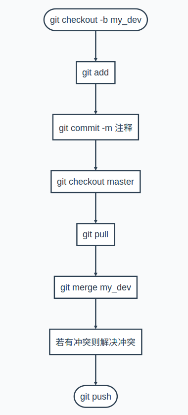

<h1 style="text-align:center">git基本操作</h1>

## git简介

* 公认的目前世界上最先进的分布式版本控制系统.
* 与传统的svn、cvs等集中式版本控制系统最大的区别是：git是**分布式**的.

## git 提交流程

### 第一种方式
新建分支，在自己的分支上开发，然后merge到要推送的分支：

小结:

1. `git checkout 新分支'
2. `git add 要提交的目录或文件` .代码当前目录下的所有
3. `git commit -m 注释`
4. `git checkout 要提交的分支`
5. `git pull`
6. `git merge 刚才修改的分支`
7. `git push origin 要提交的分支名`

### 第二种方式
在主分支开发，直到最后推送之前做一次commit：

小结：

1. `git stash`
2. `git pull`
3. `git stash pop`
4. `git add`
5. `git commit -m 注释`
6. `git push origin 要提交的分支名`

## git 常用操作

#### 工作区、暂存区、版本库
* 工作区：就是电脑里能看到的目录
* 暂存区(Stage)
> `git add ` 就是把要提交的所有修改放到暂存区
* 版本库：.git目录
> `git commit` 就是把暂存区的内容添加到版本库中
* 本地分支推送到远程库：
> `git push origin 分支名`

#### 关联本地库与远程库
两种方式：
* 从远程库克隆到本地
> `git clone 远程库地址`

* 从已存在的本地库关联远程库
> 1. `git init`
> 2. `git remote add origin 远程库地址`
> 3. `git add <file>`
> 4. `git commit -m "first commit"`
> 5. `git push -u origin master`

#### 查看分支当前状态

* `git status `

#### 查看文件的改动
* `git diff`

#### 查看提交记录
* `git log`
* `git log --stat`
* `git log -p`

#### 拉取代码
* `git pull`
* `git fetch`

#### 储藏当前工作现场
* `git stash`
* 恢复工作现场：`git stash pop`
* 查看已经储藏的工作现场：`git stash list`

#### 解决冲突  
* 手动解决。
> Git用<<<<<<<，=======，>>>>>>>标记出不同分支的内容.
解决完后手动add到暂存区。
* 使用对比工具解决：`git mergetool`

#### 撤消与回退
* `git reset`
* `git reset --soft`
* `git reset --hard`(慎重使用)
* `git checkout`
* `git revert`

#### 分支的操作
* 查看分支：`git branch   / git branch -a`
* 创建分支：`git branch <name>`
* 切换分支：`git checkout <name>`
* 创建+切换分支：`git checkout -b <name>`
* 合并某分支到当前分支：`git merge <name>`
* 删除本地分支：`git branch -d <name>`
* 推送本地分支到远程库： `git push origin <name>`
* 强制推送本地分支到远程库：`git push -f origin <name>`(有可能冲掉别人的代码，慎用，没事别用)
* 删除远程服务器上的分支： `git push origin -d <name>`

#### tag标签
* 查看所有标签：`git tag`
* 新建一个标签： `git tag <tagname>` / `git tag -a <tagname> -m 说明`
* 给某一次commit打tag： `git tag <tagname> commit的id`
* 删除标签：`git tag -d <tagname>`
* 推送某个标签到远程：`git push origin <tagname>`
* 推送全部本地标签：`git push origin --tags`
* 切换到某个标签: `git checkout <tagname>`

小结打tag流程：

1. `git tag <tagname>`
2. `git push origin <tagname>`

#### 打差分文件包
* `git diff > 文件名`
* `git format-patch`
* 应用patch:
> `git apply <patch>` / `git am <patch>`

#### 其它
*  在commit代码或merge分支以前，一定保证当前分支是最新的.如果已经pull过最新代码，在commit本地后又发现有新的提交，则可使用`git reset`撤消commit,重新pull代码再commit.
*  本地分支名称要与远程分支名一致，否则push时会新建一个远程分支。
* .gitignore文件一定要在项目开始时就创建，否则一但开始版本控制再加入的规则就不起作用了

<h4 style="text-align:right">by Mojota</h4>
