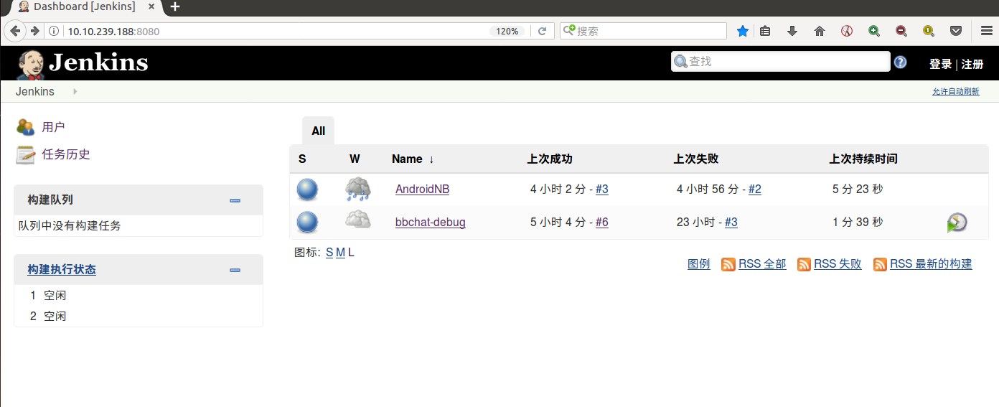
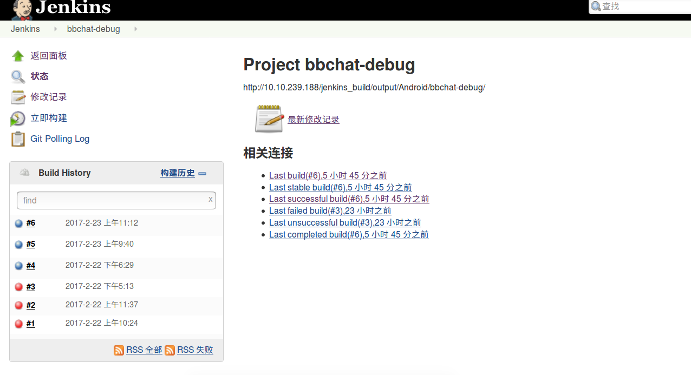
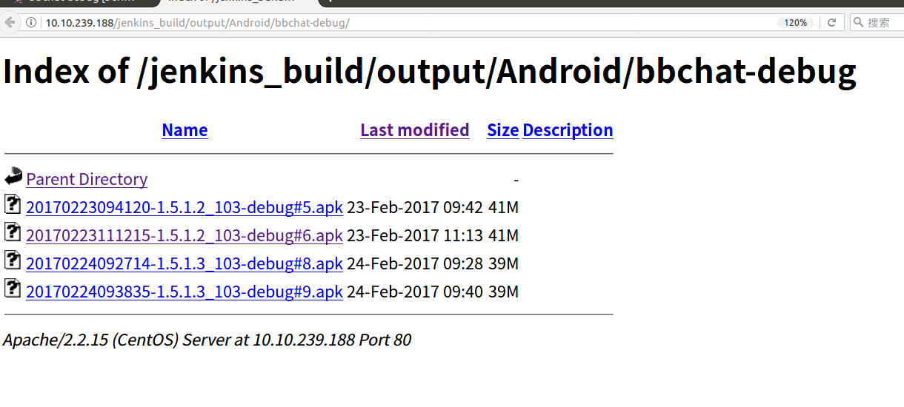
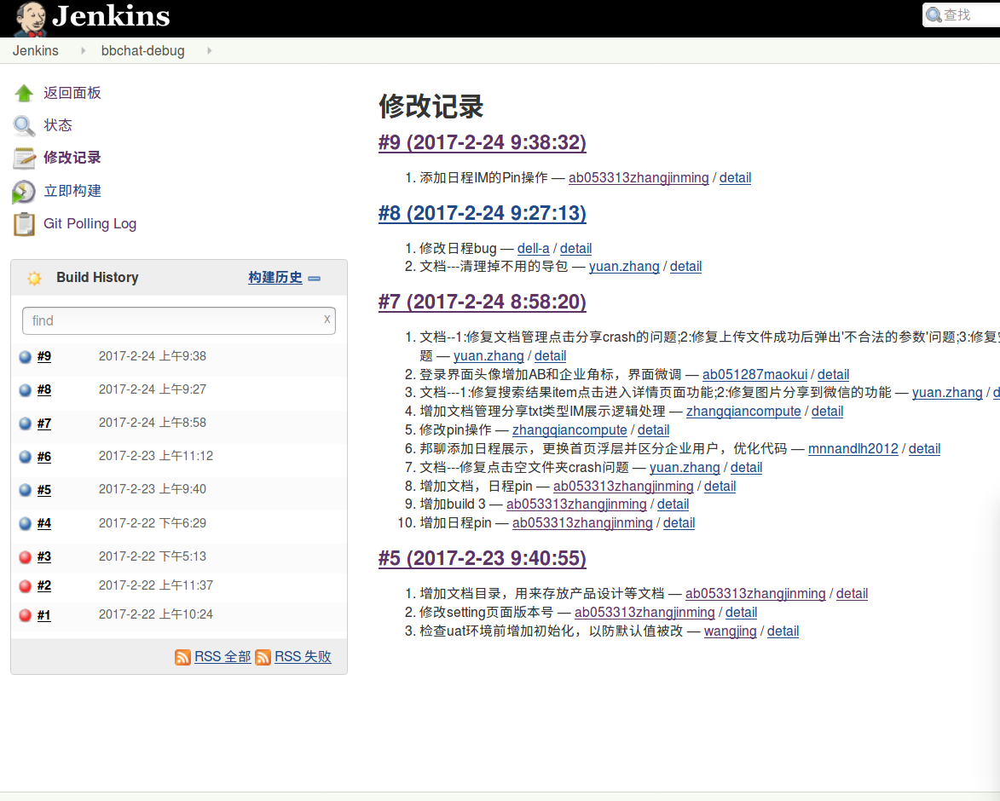
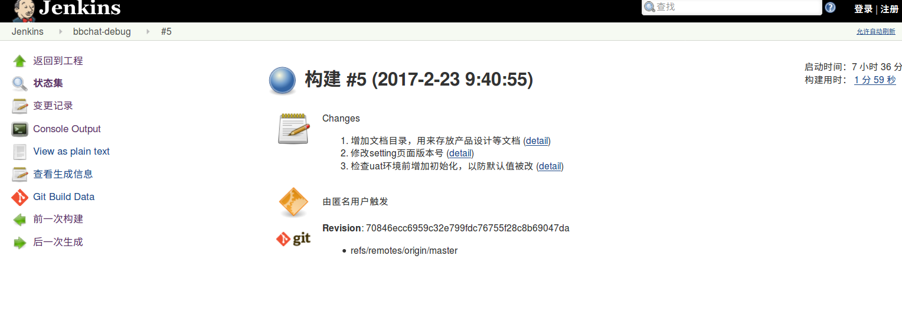
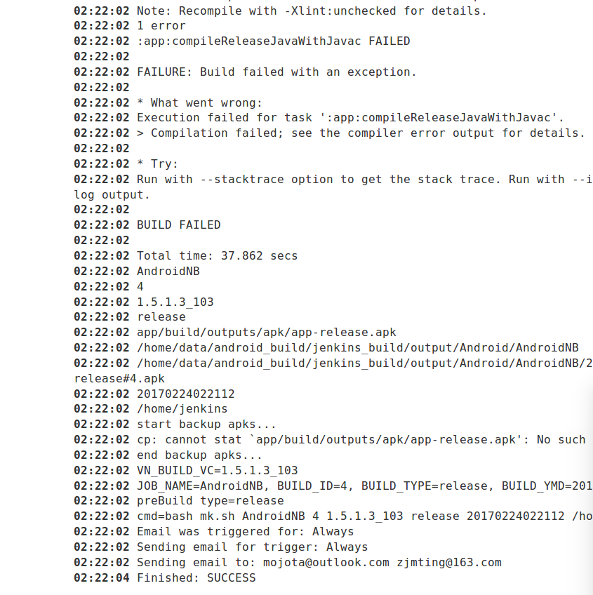

<h1 style="text-align:center">Jenkins简单使用指南</h1>

### Jenkins简介
* Jenkins 是一个开源项目，提供了一种易于使用的持续集成(CI)系统，使开发者从繁杂的集成中解脱出来，专注于更为重要的业务逻辑实现上。同时 Jenkins 能实施监控集成中存在的错误，提供详细的日志文件和提醒功能，还能用图表的形式形象地展示项目构建的趋势和稳定性。
* Jenkins可以做到持续编译和发布软件项目，这使得开发者很容易把他们的改动集成到项目中，还让用户能更加便利的获取编译和测试版本；
* 前身叫Hudson。

概括：
```
1 持续、自动地构建/测试软件项目。
2 监控一些定时执行的任务。
```

### 一、访问地址
[http://10.10.239.188:8080](http://10.10.239.188:8080)


### 二、匿名用户使用（也可自行注册）
目前匿名用户与注册用户的权限一样。



目前有两个任务:

1 ** AndroidNB 周一到周五凌晨2点自动构建出包，未开放用户手动构建权限。 **

2 ** bbchat-debug 用户可根据自己需要执行构建。点击构建按钮即可，也可以进入任务详情点击立即构建: **



### 三、下载地址
每个任务详情中任务名称下面的地址是生成的apk包的地址，可以去下载。

* 地址路径规则:以http://10.10.239.188/jenkins_build/output/Android/ 为前缀，最后是任务名称如:

http://10.10.239.188/jenkins_build/output/Android/bbchat-debug



* APK名称规则为:
> ``` 年月日小时分钟秒-versionName.version_versionCode-编译类型(debug or release)#jenkins编译流水号 ```

### 四、查看修改记录
任务详情左侧 ** 修改记录  ** ，对应的是每次构建的提交记录。



### 五、查看构建历史及详情
* 左侧 ** Build History ** 为构建历史，一般来讲：构建成功在build History列表中会以蓝色小球标识，失败会以红色小球标识。但也经常有代码编译失败，但显示构建成功的情况，所以如果在下载地址中没有找到相应的apk，那最好查看一下构建日志。点击每个历史条目可以查看每次构建的详细信息。



* 每次的构建详细信息里可以看到状态，包括提交记录、触发构建的用户、git上的版本号、控制台输出等。其中控制台输出 **Console Output**可以查看构建日志。



* 一般常见的构建失败的原因有：编译失败、不能拉取代码等。

### 六、构建通知
构建完成后，可以发送构建通知到已配置的邮箱中。
目前的邮件格式为:
``` 
bbchat-debug - Build # 10 :
构建项目：bbchat-debug
构建状态：Successful
下载地址：http://10.10.239.188/jenkins_build/output/Android/bbchat-debug/
请到此查看详情： http://10.10.239.188:8080/job/bbchat-debug/10/
变更记录：xxx。
```
有需求的话再调整。


### 七、其它
1、uat环境的切换方法：
```
在手机设备根目录下创建名为 bbchat_uat 的空文件，杀掉进程重启即为uat环境，无此文件为生产环境。
```

<h4 style="text-align:right">by 王静</h4>