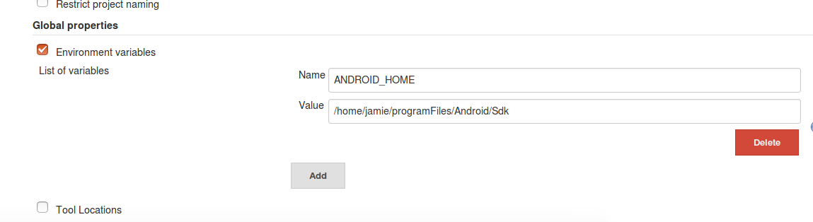
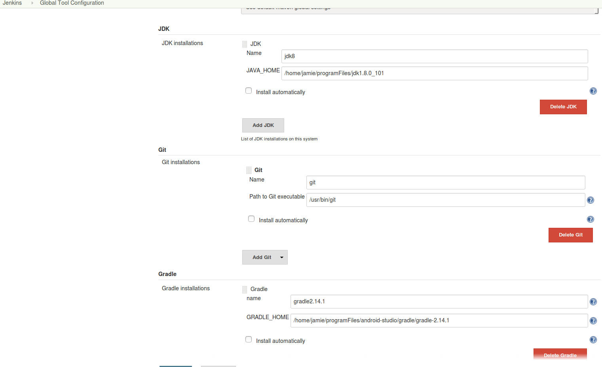
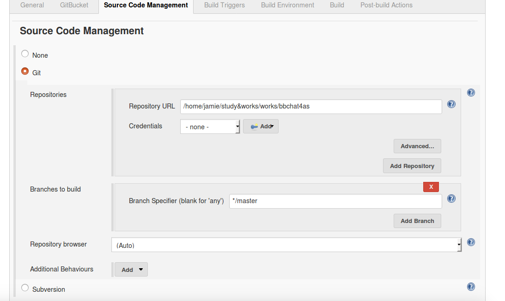
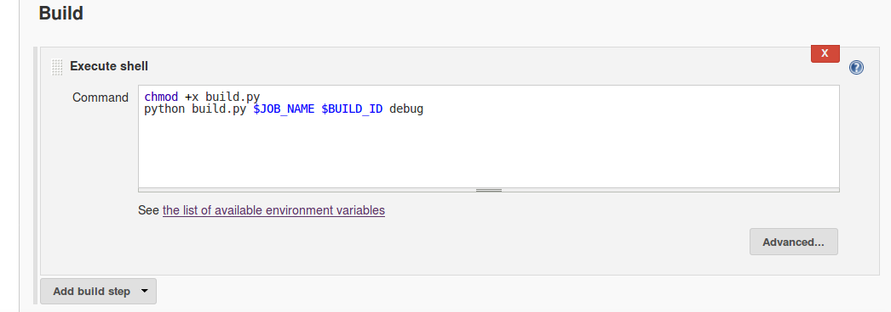

## 配置集成环境
### 系统添加用户
* adduser xxx
* passwd xxx
* 授权

```
[root@localhost ~]# chmod -v u+w /etc/sudoers

在下面的一行下追加新增的用户
[root@localhost ~]# vim /etc/sudoers

## Allow root to run any commands anywher  
root     ALL=(ALL)       ALL  
newuser  ALL=(ALL)      ALL  #这个是新增的用户

[root@localhost ~]# chmod -v u-w /etc/sudoers
```
参考：[在centos7中添加一个新用户，并授权](http://www.cnblogs.com/woshimrf/p/5906084.html)

### 安装jdk
最好下载jdk 7以上版本，最好jdk 8。

```
mkdir /home/xxx/programs
cd /home/xxx/programs
tar -zxvf xxx.tar.gz
vi ~/.bashrc
在文件尾部添加：
export JAVA_HOME=/home/xxx/programs/jdk1.8.0_101
export JRE_HOME=/home/xxx/programs/jdk1.8.0_101/jre
export PATH=$JAVA_HOME/bin:$JRE_HOME/bin:$PATH
export CLASSPATH=.:$JAVA_HOME/lib:$JRE_HOME/lib:$CLASSPATH
```

### 安装Android Sdk
```
配置环境变量
vi ~/.bashrc
在文件尾部添加：
export PATH=$PATH:/home/xxx/programs/Android/Sdk/tools:/home/xxx/programs/Android/Sdk/platform-tools
```

### 安装gradle
与目前项目一致，使用2.14.1
* [下载gradle-2.14.1-all.zip](http://services.gradle.org/distributions)
* 解压到/home/xxx/programs/
```
配置环境变量
vi ~/.bashrc
在文件尾部添加：
export GRADLE_HOME=/home/xxx/programs/gradle-2.14.1
export PATH=$GRADLE_HOME/bin:$PATH
```

### 64位centos需要安装的库
> 安装以下的32位库才可编译
yum install glibc.i686
yum install glibc-devel
yum install libstdc++.i686


### 安装git
``` yum install git ```

### 安装jenkins
* [下载jenkins.war](https://jenkins.io/index.html)
* java -jar jenkins.war 启动
* http://localhost:8080 初次访问安装必要的插件,也可选用推荐安装
> 包括不限于以下
> * git plugin
> * Android Lint Plugin
> * Gradle Plugin
> * Email Extension Template Plugin

### 配置Configure System
Manage Jenkins-> Configure System -> Global properties
勾选Environment variables 添加ANDROID_HOME value为android sdk目录


### 配置Global Tool Configuration
Manage Jenkins-> Global Tool Configuration
配置JDK、Git、Gradle


### 添加用户和管理权限
参考:[Jenkins配置:添加用户和管理权限 ](http://blog.csdn.net/achang21/article/details/48711583)

### jenkins邮件通知
参考:[使用email-ext替换Jenkins的默认邮件通知](http://www.cnblogs.com/zz0412/p/jenkins_jj_01.html)

### 配置jenkins开机自启动
*** 以下只适用于centos ***

1  在/home/xxx/ 下新建jenkins.sh
```
#!/bin/sh
# chkconfig: - 80 20
# description: auto_start_jenkins_sevcie

JENKINS_ROOT=/home/jenkins/programs
JENKINSFILENAME=jenkins.war

start(){
    echo "Starting $JENKINSFILENAME "
	su - jenkins -c "java -jar $JENKINS_ROOT/$JENKINSFILENAME & "
}

stop(){
    su - jenkins -c "ps -ef|grep $JENKINSFILENAME |awk '{print $2}'| xargs kill -9"
}

status(){
    ps -ef|grep $JENKINSFILENAME
}

case "$1" in
start)
  start
  ;;
stop)
  stop
  ;;
restart)
  stop
  start
  ;;
status)
  status
  ;;
*)
  printf 'Usage: %s {start|stop|restart|status}\n' "$prog"
  exit 1
  ;;
esac
```

2  加权限
` chmod 555 jenkins.sh` 为保证安全，置为不可写

3  在/etc/init.d中创建软连接
`sudo ln -s /home/jenkins/programs/jenkins.sh jenkins`

4  使用chkconfig设置自启动
```
sudo chkconfig --add jenkins
sudo chkconfig --level 2345 jenkins on
```

5  测试
`service jenkins start `  如此，开机即可自动启动。

>  注意点： 
1.   通过/etc/init.d来实现自启动，如果没做#3就没法开机自启动。
2.   注意脚本的前三行，如果格式不正确就无法使用chkconfig加载
* 说明是可执行脚本
* 说明是chkconfig的格式，可以加到service中，三个参数分别是 
§  可执行的环境 （- 表示所有环境，或者常用的2345）
§  start的优先级
§  stop的优先级
* 说明service的描述


参考:[Linux 开机自启动](http://blog.csdn.net/zhouzihan520xj/article/details/40740617)
[centos/ubuntu jenkins.war 自启动脚本](http://blog.csdn.net/fenglailea/article/details/42557751)

_ _ _

### 创建任务
* New Item -> Enter an item name -> Freestyle project
* Source Code Management源码管理 选择GIt。
> * Repository URL : 可埴写项目路径，或若想从本地读则填本地路径。
> * Credentials: 账号密码或ssh认证信息。本地代码的话不需要设置。
> * Branches to build:要编译的分支



* Build Triggers
> * 若gerrit，则选择Gerrit event
> Choose a Server ： 可选择单个gerrit服务器，默认任何服务器
> Trigger on      ： 选择触发策略，默认 选中了Patchset created ，可以自己添加
> Gerrit project  ： 左侧为项目名称(**:表示所有)，右侧为分支名称(**:表示所有)

> * 若为本地代码，则勾选Poll SCM
> Schedule ： 触发的时间策略 如 0 7 \* \* \* 表示 每天7点 等等

* Build
> * Add build step -> Execute shell
> Command : 执行
> ```  chmod +x build.py ```
> ```  python build.py $JOB_NAME $BUILD_ID debug ```
> * 以上为编译debug版本若创建一个编译release版本的任务，则改为:
> ```  chmod +x build.py ```
> ```  python build.py $JOB_NAME $BUILD_ID release ```



* Save 保存以上的配置

### 编译后的apk路径为编译脚本中设置的
* home/xxx/jenkins/Android/
* home/xxx/.jenkins/workspace/任务名/output/Android/
* 以上两个路径各有一份,放在workspace下方便在jenkins中访问到。


<h4 style="text-align:right">by 王静</h4>